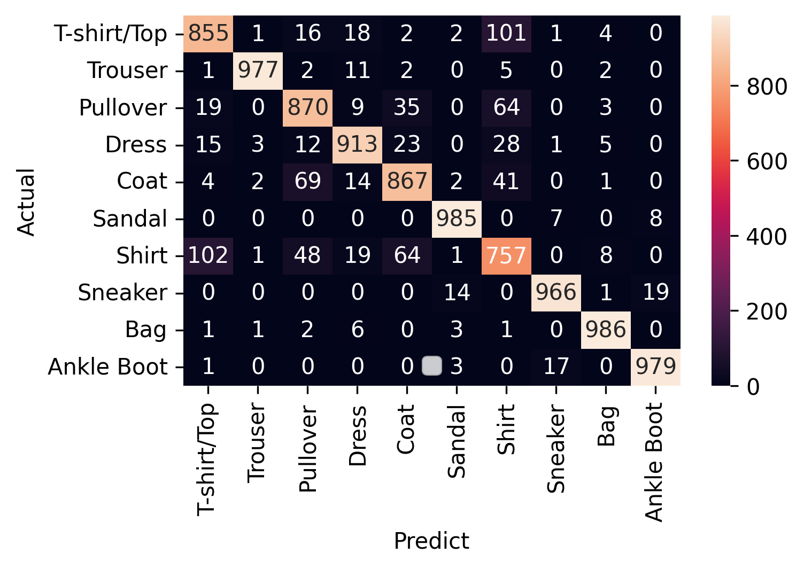

# Fashion MNIST Image Classification using CNN

## Project Overview

This project implements a Convolutional Neural Network (CNN) using TensorFlow and Keras to classify Fashion MNIST images into 10 clothing categories.

## Dataset

- 70,000 Images
- 10 Categories
- Image Size: 28×28 pixels
- Grayscale Images

## Fashion MNIST Classes

| Label | Category |
|---------|---------|
| 0 | T-shirt/Top |
| 1 | Trouser |
| 2 | Pullover |
| 3 | Dress |
| 4 | Coat |
| 5 | Sandal |
| 6 | Shirt |
| 7 | Sneaker |
| 8 | Bag |
| 9 | Ankle Boot |

## Technologies Used

- Python
- TensorFlow
- Keras
- NumPy
- Pandas
- Matplotlib
- OpenCV

## CNN Architecture

Input Layer (28x28x1)

↓

Conv2D (32 Filters, ReLU)

↓

MaxPooling2D

↓

Flatten

↓

Dense (785 Units)

↓

Dense (10 Units, Softmax)

## Results

### Visualizing the Errors
Below is the generated confusion matrix highlighting where the model confuses shirts with pullovers and coats:

Model achieved an overall classification accuracy of **92.00%** on the Fashion MNIST test dataset. 

### Key Performance Metrics
* **Overall Accuracy:** 92.00%
* **Macro Average F1-Score:** 0.92
* **Weighted Average F1-Score:** 0.92

### Analysis & Observations
* **Strongest Performers:** The model excelled at identifying **Class 1** (98% F1-score), **Class 5** (98% F1-score), and **Class 8** (98% F1-score).
* **Weakest Performer**: **Class 6** (Shirt) achieved the lowest F1-score of 76%, indicating that the model frequently confuses shirts with visually similar categories such as T-shirts, pullovers, or coats..
* **Target Areas for Improvement:** Future iterations will focus on spatial features to better differentiate between Class 6, Class 4 (87% recall), and Class 2 (86% recall).
